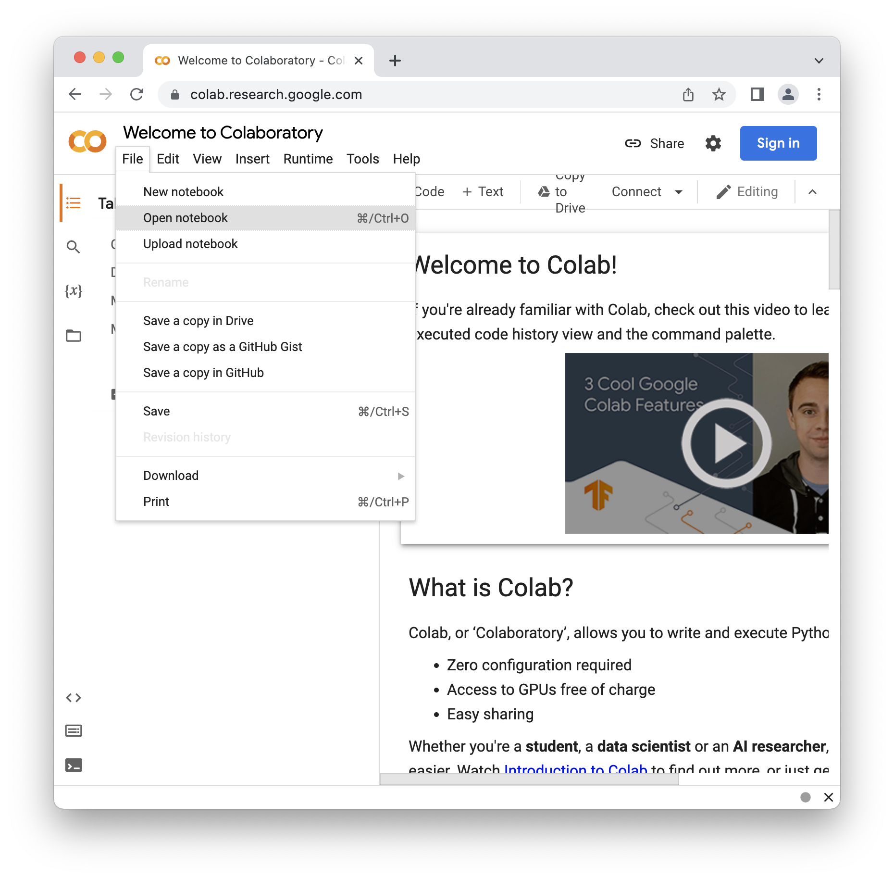
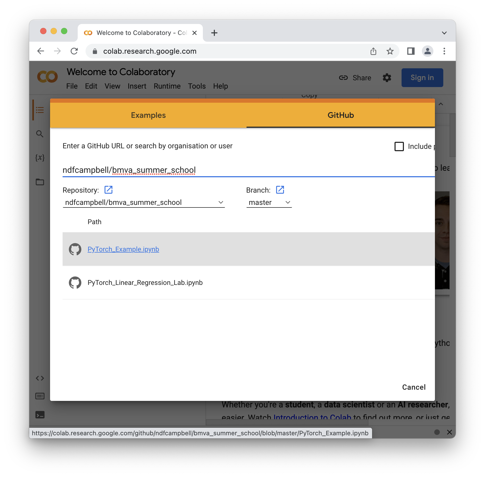

# BMVA Summer School
PyTorch Lab for the BMVA Summer School

Please read the PDF for the introduction to PyTorch.

Use Google colaboratory to run the notebooks!

[http://colab.research.google.com/](http://colab.research.google.com/)

# How to open the demos in Google colab:

- Open a browser and go to [http://colab.research.google.com/](http://colab.research.google.com/)

- Select "Open Notebook" from the menu

- Select "GitHub" and type "`ndfcampbell/bmva_summer_school`" into the address bar

- Load the PyTorch_Example file first and then take a look at the linear regression lab!

## Extension:

- If you are curious as to how PyTorch (and similar libraries) work behind the scenes then please take a look at the Scalar Auto Grad Demo file!

## Advanced:

- If you are already familiar with PyTorch then you may be interested in the advanced notebook on Vision Foundation Models kindly provided by [Li (Luis) Li](https://www.luisli.org); please see the instructions within the file, in particular using GPU acceleration when loading on the colab server.
